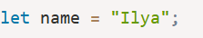
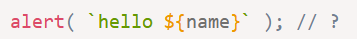

# Day 1 — 2026-09-11（周五）

> **状态：Day 1 四项任务全部完成 ✅**（2026-09-11）

## 今日目标
- [x] 安装 Node.js（v24.21.0）+ npm 11.19.0 + pnpm 12.3.4
- [x] 安装 Git 并配置身份
- [x] 建立本仓库目录结构
- [x] 学 JS 类型系统：7 种原始类型 + 1 种引用类型、`typeof`、显式/隐式转换、`==` vs `===`
- [x] 写 26 道"表达式结果预测"题（`week1-language/day01-types-prediction.js`）
- [x] commit + push 到 GitHub

## 今日产出
| 文件 | 内容 |
|---|---|
| [`notes/day01-types.md`](day01-types.md) | Day 1 学习指引：资源清单、26 道题面与标准答案 |
| [`week1-language/day01-types-prediction.js`](../week1-language/day01-types-prediction.js) | 26 题的原始作答记录 |
| [`notes/day01-mistakes.md`](day01-mistakes.md) | **错题本**：逐题记录、错因聚类、补课清单、12 道变式复练题 |

## 学会了什么
1. 环境链路全通：Node + npm + pnpm + Git 装好并配好身份，仓库 `js-node-30days` 已在 GitHub 建好、push 打通。
2. 引用类型 vs 值类型的核心区别已经建立：Q23（`b.n = 2` 会改到 `a.n`）、Q24（`y = 2` 不影响 `x`）、Q25（`new Number(1) === 1` 为 `false`）全部答对。
3. 简单隐式转换能跟上：`'5' + 2`、`'3' + 2 + 1`、`null == undefined`、`null === undefined` 都答对了。

## 卡在哪里
- 26 题成绩：**10 对 / 5 错 / 11 空白**。最该改的不是"错了 5 道"，是**空了 11 道**——连猜都没猜，面试里等于零信息。
- `==` / `===` 是本次失分最集中的一组（Q19、Q20 答错，Q21、Q22 空白），而这一组恰恰是面试最爱问的。
- 数组/对象参与 `+` 运算时的隐式转字符串（ToPrimitive）是真正的知识盲区，主线书单确实没覆盖到这一环。
- 完整记录和补课清单见 [`notes/day01-mistakes.md`](day01-mistakes.md)。

## 踩过的坑
- GitHub 网页端不能创建空目录：Git 只跟踪文件不跟踪目录。想在网页建目录，要在新建文件时把路径写进文件名，例如 `week1-language/.gitkeep`。
- 本机未安装 Git，`git` 命令不识别。Node 装好不等于 Git 装好，两者是独立的。
- `git remote add origin` 时把占位符原样复制了（`https://github.com/你的用户名/...`），push 报 `fatal: repository not found`。凡是出现"你的 XXX"、`<xxx>`、中文的地方都是占位符，必须替换成真实值。用 `git remote -v` 可以查看当前填的地址，`git remote set-url origin <新地址>` 可以改。
- **没有注意到图一中的 `Ilya`**：图一和图二是同一段示例代码的上下两行，我只顺着图二往下抄，漏看了图一里已经写死的变量值，敲出来的代码跟示例对不上。抄代码前要把每张图从上到下完整看一遍，变量名、字符串内容逐字核对。

| 图一：这里定义了 `Ilya` | 图二：这里用到了 `name` |
|---|---|
|  |  |

- **对着浏览器教程写 Node 代码**：练习文件通篇用的是 `alert(...)`，但 `alert` 是浏览器 API，Node 里根本没有这个函数，一跑就是 `ReferenceError: alert is not defined`。以后一律用 `console.log`。
- **VS Code 自动补全偷偷插进来一行**：文件第 4 行冒出一句 `const { cloneElement } = require("react");`，Node 里跑会报 `Cannot find module 'react'`。提交前要通读一遍 diff，不能闭眼提交。
- **整份练习文件几乎全是注释**，`node text_9_11.js` 跑起来什么都不输出。而 `day01-types.md` 里写的是"预测 → **验证** → 解释差异"——只做了"预测"，跳过了"验证"，所以没拿到任何反馈，这也是空白题多的直接原因。写练习必须让文件真的能跑。

## 明天第一件事（9/12，Day 2）
- 先花 30 分钟把错题本的 P0 做完（见 [`notes/day01-mistakes.md`](day01-mistakes.md) 第五节）：
  1. 打开 `node`，把 26 题逐条敲进去跑一遍，对不上的当场追问为什么；
  2. 补两章：[对象 —— 原始值转换](https://zh.javascript.info/object-toprimitive) + [数组](https://zh.javascript.info/array)（`toString` 小节）；
  3. 默写 `typeof` 的全部 8 种返回值。
- 然后进入 Day 2 主题：函数与作用域（声明/表达式/箭头函数差异、默认参数、rest/spread、作用域链、暂时性死区）。

## 代码 / 命令备忘
```powershell
# 表达式预测题的验证方式：写成能跑的文件，用 log 打印，别用 alert
node --watch types.mjs      # 改一次自动重跑一次

# 先写答案，再运行验证（下方是 Node v24 实测结果）
0.1 + 0.2 === 0.3   → false   # 浮点数精度，0.1+0.2 = 0.30000000000000004
[] == false         → true    # [] → '' → 0；false → 0
typeof null         → 'object'  # 返回值是字符串，笔试要带引号

# 每天收尾
git add -A
git commit -m "day01: …"
git push
```
